# Git 学习笔记

### 1. git 仓库的常用操作

#### 场景１: 新的仓库本地创建新仓库后推到远端

```bash
# 创建一个新的文件夹
mkdir gitLearn

# 初始化git仓库
git init

# 可以先写一些balabala的文件，　这里用readme代替
cd gitLearn && echo '# GitLearn' >> README.md

# 提交文件
git add .

# commit
git commit -m 'first commit'

# 添加远端仓库
git remote add origin [github仓库地址]

# push
git push origin master

```

#### 场景 2.　有远端仓库

- 直接 clone 即可, 如果是走 ssh 必须在 github 仓库中配置 ssh-key

### 2. 没有冲突的一般 git 流程

- git add [所需要提交的文件名]
- git commit -m [提交需要提示的信息]
- git push origin [分支名]

### 3. 解决冲突的办法

#### 1. 冲突模拟

- 用户 2 和用户 1 同时修改一个文件
- 修改完之后一个提交后，另一人提交会出现冲突

1. 先提交用户 2 的代码到远端

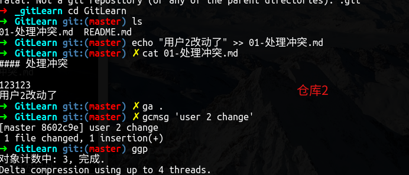

2. 用户 1 提交代码到远端


3. 解决冲突的办法

- 先通过 git pull 拉一下代码, 发现自动合并代码失败, 需要进行手动合并

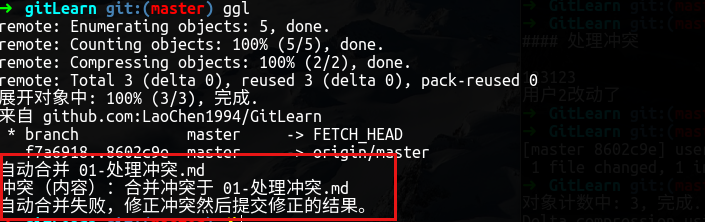

- 打开 vscode 对需要保留的地方进行更改，这里我们假设两者更改的部分都需要进行修复

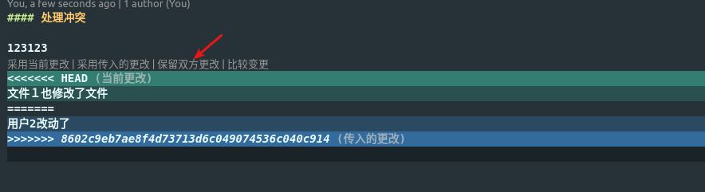

- 修复完成后我们就解决了冲突， 所有冲突解决完毕之后可以按照正常流程进行提交

### 4. 代码的回滚

[李刚的 git 撤销回退笔记](https://blog.csdn.net/ligang2585116/article/details/71094887)

#### 1. 模拟代码提交过程

**场景一： 没有 git add 的情况**

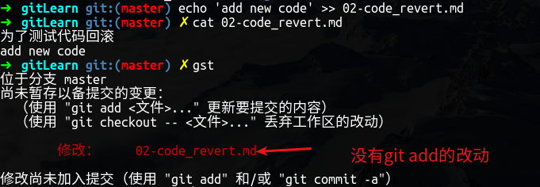

- 解决方法： git check out

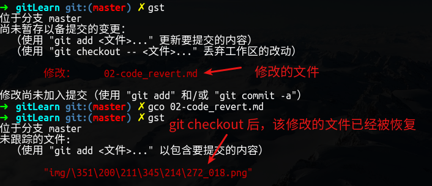

#### 2. 代码已 add

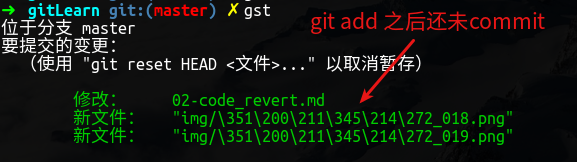

- 解决方法: git reset HEAD [文件名]

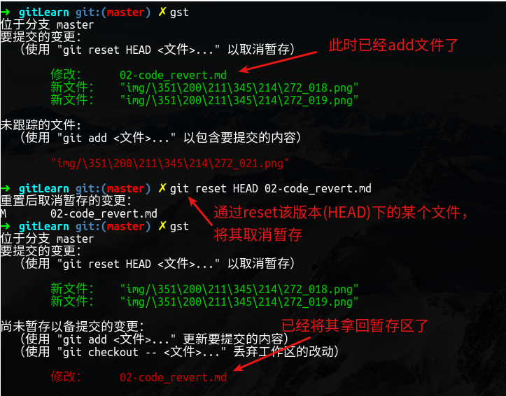

#### 4. 代码已经 commit


- 查看 git log

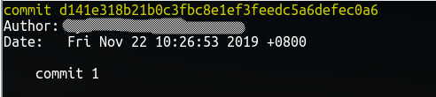

- 解决方案: git reset

  - git reset --mixed HEAD~1: 撤销上一次 git commit 操作, 并撤销 git add
  - git reset --soft HEAD~1: 撤销上一次 git commit 操作, 并不撤销 git add 操作
  - git reset --hard HEAD~1: 恢复到上一次 commit 操作, **不保存本次修改的代码！！！**

- git reset --mixed

  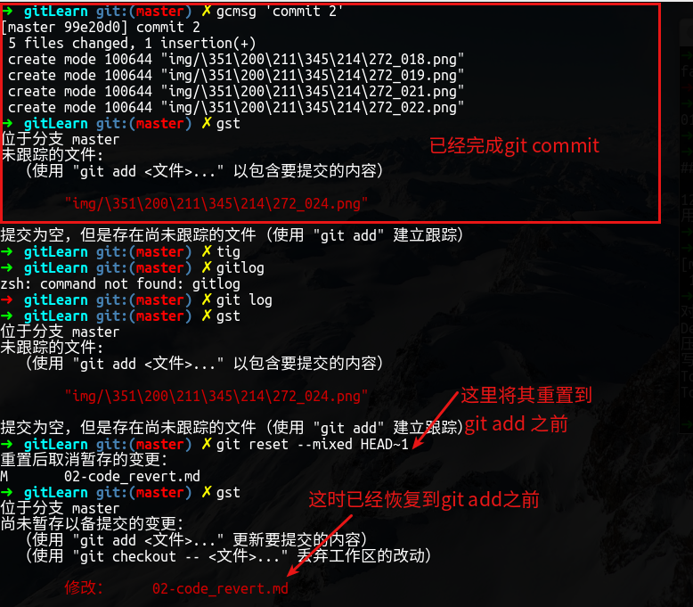

- git reset --soft

  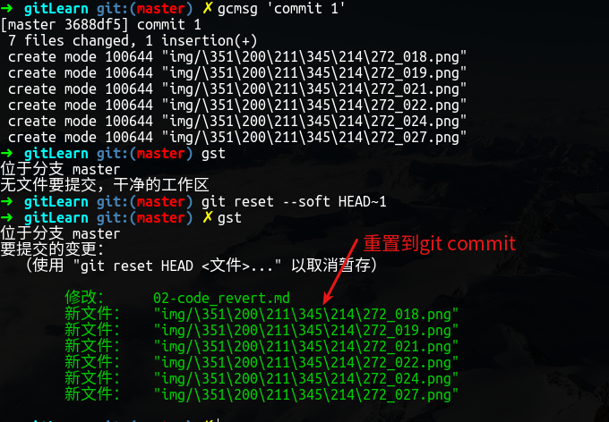

- git reset --hard

  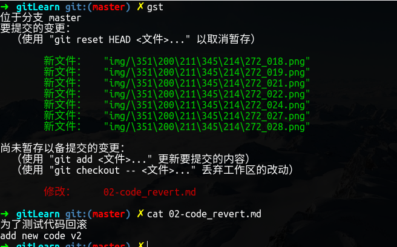

#### 5. 代码已被 push

​ 方法 1: 撤销指定文件到指定版本

```bash
# 查看某文件的提交版本
git log <fileName>
# 找到文件想要回滚的版本号
git checkout <commitId> <fileName>
# 按照正常方法提交即可
git add .
git commit -m 'test'
git push origin master
```

​ 方法 2: 删除最后一次远程提交

```bash
# 取消上一次的commit
git reset --hard HEAD~1
git push orgin master -f
```
